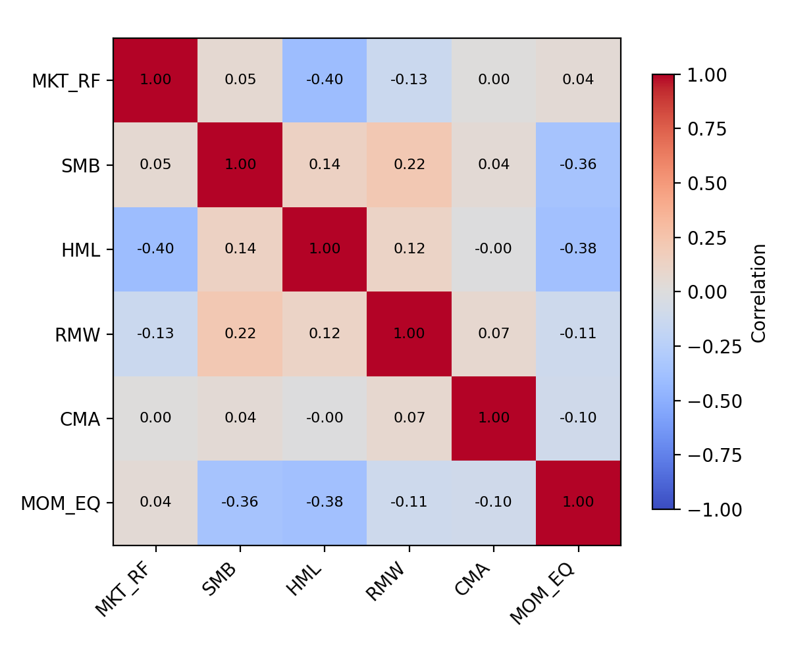
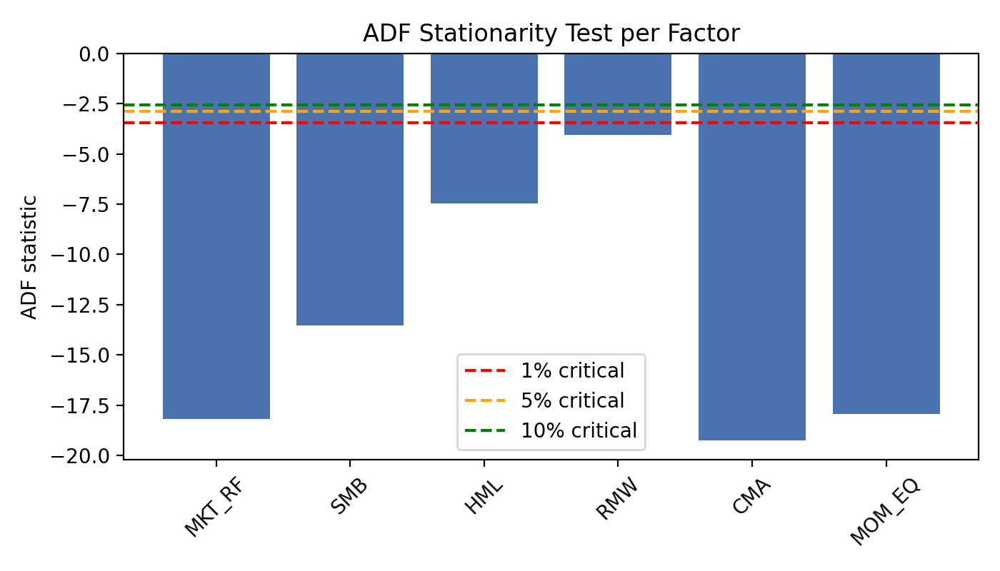

# Factor Diagnostics Results

本目录集中展示相关性与平稳性两类检验，配合 `docs/factor_details.md` 的文字说明，可快速了解最新的因子健康状况。

## 1. 相关性 (correlation)
- 数据源：`docs/factor_correlations.csv`
- 可视化：`correlation/correlation_heatmap.png`
- 样本：2019-08-09 ~ 2025-12-05，共 299 个周度观测。



> 亮点：`SMB` 与 `MOM_EQ`、`HML` 与 `MOM_EQ` 相关系数约 -0.36~-0.38，说明动量补充了规模、价值无法解释的部分；其余系数绝对值小于 0.4，不易导致多重共线性。

## 2. 平稳性 (stationarity)
- 数据源：`docs/factor_stationarity.csv`
- 可视化：`stationarity/adf_stats.png`



> 所有 ADF 统计量均落在 1% 临界值之下（见彩色虚线），p 值远小于 0.01，支持“各因子周度序列在样本期内平稳”这一假设，可直接用于线性回归与相关性分析。

若需更新图表，依次运行：
```bash
python code/momentum_comparison.py   # 生成/刷新各动量因子
python code/factor_diagnostics.py    # 导出 CSV 并绘图
```
